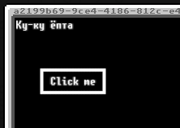

# Fox UI

Это "Мощь, которая и не снилась моему отцу". Околокостыльная библеотека-фреймворк для работы с UI интерфейсом OpenComputers, работающая от чистого GPU с шиной событий на базе event.listen для максимальной производительности и скорости выполнения всего того говна, что придётся ему рендрить.

## Usage & Example

Пример использования Fox UI:

```lua
local fox = Fox:new()

fox.mount("button", {
    x = 5,
    y = 5,
    text = "Click me",
    onClick = function ()
        print("Ку-ку ёпта")
    end
})
```

Код выше - кнопка, отрисуется на экране, и при клике на неё будет выполнять `onClick` функцию. Результат:


